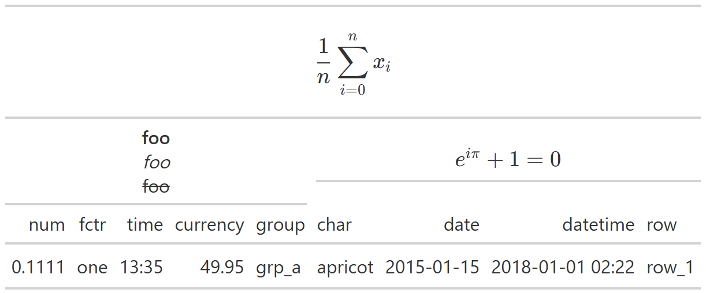

```{r}
#| label: thumbnail
#| echo: false
#| out-width: 75%
#| fig.asp: 0.525
ggplot2::ggplot() +
  ggplot2::theme_void() +
  ggplot2::annotate(
    geom = "text",
    x = 0,
    y = 0,
    label = "gt::tab_spanner_delimで\n作ったspannerに\ngt::mdを効かせる",
    family = "Gen Jyuu GothicX",
    fontface = "bold",
    size = 10
  ) +
  patchwork::inset_element(
    p = png::readPNG(
      source = paste0(Sys.getenv("R_USER"), "/resources/Rlogo.png"),
      native = TRUE
    ),
    left = 0,
    bottom = .8,
    right = .2,
    top = 1
  )
```

## Packages
```{r}
#| output: false
pacman::p_load(
  tidyverse,
  gt
)
```

## Contents
### Problem
`gt`パッケージ[^pkg_gt]でちょっと凝った表を作ろうとしたときにつまずきました。

[^pkg_gt]: <https://gt.rstudio.com/>

```{r}
gt_iris <- 
  iris |>
  pivot_longer(
    cols = -Species,
    names_to = "variables"
  ) |>
  reframe(
    mean = mean(value),
    sd = sd(value),
    .by = c(Species, variables)
  ) |>
  pivot_wider(
    names_from = Species,
    names_sep = "_",
    names_vary = "slowest",
    values_from = c(mean, sd)
  ) |>
  gt() |>
  fmt_number(decimals = 2)

gt_iris
```

こんな感じで表頭に群、表側に変数を並べるスタイルがあると思います。このとき、列名は"指標名_群名"となっているので、`gt::tab_spanner_delim()`を使って、区切り文字で分割して群をspannerにまとめることができます。
```{r}
gt_iris |>
  tab_spanner_delim(
    delim = "_", # <1>
    reverse = TRUE # <2>
  )
```
1. 引数`delim`に区切り文字を指定する。
2. 引数`reverse`はspannerの取得方向を逆転させるかどうか。デフォルトだと区切り文字の前にあるものがspannerとして採用されるけど、今回は区切り文字の後ろにある群名をspannerにしたいので、TRUEにする。

さて、ここで`iris`データの各群（種）は50個ずつデータがあるので、それを群名に付け足したいと思います。群の下に(n = 50)とするのがいいでしょうか。ということで`gt::text_transform()`を使って、表に現在ある文字を直接入れ替えていきます。`gt`には`gt::md()`という入力をマークダウンテキストとして扱ってくれるヘルパ関数があるので、それを中で使います。
```{r}
gt_iris |>
  tab_spanner_delim(
    delim = "_",
    reverse = TRUE
  ) |>
  text_transform(
    fn = \(x) {
      str_replace_all(
        x,
        pattern = c(
          "setosa" = "Setosa<br>(*n* = 50)",
          "versicolor" = "Versicolor<br>(*n* = 50)",
          "virginica" = "Virginica<br>(*n* = 50)"
        )
      ) |>
        gt::md()
    },
    locations = cells_column_spanners()
  )
```

はい、なぜかうまくいきません。

後からテキストを変えているのが原因かもしれないので、元dfの列名からいじってみます。
```{r}
iris |>
  pivot_longer(
    cols = -Species,
    names_to = "variables"
  ) |>
  reframe(
    n = n(),
    mean = mean(value),
    sd = sd(value),
    .by = c(Species, variables)
  ) |>
  pivot_wider(
    names_from = c(Species, n),
    names_glue = "{Species}<br>(*n* = {n})_{.value}",
    names_vary = "slowest",
    values_from = c(mean, sd)
  ) |>
  print() |> # only for displaying
  gt() |>
  fmt_number(decimals = 2) |>
  tab_spanner_delim(delim = "_") |>
  text_transform(
    fn = \(x) gt::md(x),
    locations = cells_column_spanners()
  )
```

はい、うまくいきません。というわけで、何か工夫をしないと`text_transform()`でspannerのマークダウンフォーマットはできないようです。

### Solution
#### `gt::tab_spanner()`
解決策の一つ目は、愚直に`gt::tab_spanner()`で頑張っていく方法です。spannerを作りたい分だけ`tab_spanner()`を繰り返し、引数`labels = md("...")`でマークダウン書式を書いていきます。なお、この方法だと元の列名が残ってしまうので`gt::cols_label()`などで処理する必要があります。
```{r}
gt_iris |>
  tab_spanner(
    label = md("Setosa<br>(*n* = 50)"),
    columns = ends_with("setosa")
  ) |>
   tab_spanner(
    label = md("Versicolor<br>(*n* = 50)"),
    columns = ends_with("versicolor")
  ) |>
   tab_spanner(
    label = md("Virginica<br>(*n* = 50)"),
    columns = ends_with("virginica")
  ) |>
  cols_label(
    starts_with("mean") ~ "*M*", # <1>
    starts_with("sd") ~ "*SD*", # <1>
    .fn = md # <2>
  )
```
1. `cols_label()`の中では、`LHS ~ RHS`か`<column names> = <label>`の書き方が通ります。今回の場合、平均値の列は"mean"で始まって、標準偏差の列は"sd"で始まっているので、`gt::starts_with()`を使って処理します。
2. すべてのラベルに同じ関数（今回の場合は`md()`）を作用させたい場合は、引数`.fn`に関数オブジェクトを渡すといいです。全てのRHSで都度`md(...)`を書く手間が省けます。

これで望みのものはできました。ただやはり、同じ関数を何回も繰り返すのは面倒です。

#### `lapply(x, FUN = gt::md)`
githubのissueに上がっていたやり方です。

- [Inconsistent behavior of gt::text_transform() depending on locations?](https://github.com/rstudio/gt/issues/1433)  (Github, rstudio/gt)

`text_transform()`の挙動って引数`locations`に何が来るかで違わね？（`gt::cells_body()`以外うまくいかなくね？）みたいな内容です。そこでissueした方が例として挙げていたコードに、`lapply()`を使ったものがありました。実際に使っていたのは`gt::html()`の方で、中で使われている（？）`htmltools::HTML()`がベクトルをcollapseしちゃうため`lapply`が必要と書かれていました。
```{r}
gt_iris |>
  tab_spanner_delim(
    delim = "_",
    reverse = TRUE
  ) |>
  text_transform(
    fn = \(x) {
      str_replace_all(
        x,
        pattern = c(
          "setosa" = "Setosa<br>(*n* = 50)",
          "versicolor" = "Versicolor<br>(*n* = 50)",
          "virginica" = "Virginica<br>(*n* = 50)"
        )
      ) |>
        lapply(FUN = gt::md)
    },
    locations = cells_column_spanners()
  )
```

`md()`でもうまくいきました。`md()`の戻り値はベクトルなんですが、やはりHTML化するときに何か不具合がある感じでしょうか。また、試してみたところ、同じくlistを返す`purrr::map()`ではうまくいきましたが、characterで返ってくる`sapply()`や`purrr::map_vec()`、`purrr::map_chr()`などは通りませんでした。

なお、こちらのissueではspannerのラベル変更のための新しい関数が提案されていますね。

- [New function tab_spanners_label_with and levels-param for cells_column_spanners](https://github.com/rstudio/gt/issues/1628) (Github, rstudio/gt)

パッケージとして関数を用意してもらえたら嬉しいですし、そうでなければHelpに一言あるといいなあと思いました。

#### Supplyment
やり方がわかったので、ちょっと遊んでみました。gtで作る表はtex記法にも対応しているのですが、環境によってうまく表示されないので、出力は画像にしてあります。
```{r}
#| eval: false
gt::exibble |>
  head(1) |>
  rename_with(
    .fn = \(x) {
      paste(c("foo", "buzz"), x, sep = "_")
    }
  ) |>
  relocate(starts_with("foo")) |>
  gt() |>
  tab_spanner_delim(delim = "_") |>
  tab_spanner(
    label = "bar",
    level = 2,
    columns = everything()
  ) |>
  text_case_match(
    "foo" ~ "**foo** <br> *foo* <br> ~~foo~~",
    "buzz" ~ "$e^{i\\pi} + 1 = 0$",
    "bar" ~ "$$\\frac{1}{n} \\sum_{i = 0}^n x_i$$",
    .locations = cells_column_spanners()
  ) |>
  text_transform(
    fn = \(x) map(x, .f = md),
    locations = cells_column_spanners()
  )
```
{width=75%}

## Conclusion
`gt::tab_spanner_delim()`で作ったspannerに`gt::text_transform()`を使って`gt::md()`を効かせるには`lapply()`が必要だったという話でした。豪華なspannerにしたい人は試してみてください。

## Session Infomation

:::{.callout-note collapse=true title="sessioninfo"}

```{r}
#| echo: false
sessionInfo()
```

:::
